# Personalized AI Sports Live Stream Commentator

A real-time AI sports commentator that narrates live streams **exactly to the taste of each user**. Unlike generic commentary, this system adapts to your favorite team, knowledge level, and preferred commentary style.

### Problem
- one big problem with sports live stream is generic commentary does not feel interesting to everyone and not accessible to everyone either
- not everyone understands the game enough so they feel left out and bored
- so that results in less viewer engagement and ultimately missed revenue for game organizers

### solution
- so i'm trying to solve that with personalized commentary 
- with this system users will be able to provide their fav team, their sports understanding level and their prefeered commentary style and their accessibility needs too

## Features

- **Favorite Team Support**: Root for your team! The commentator shows extra excitement when your team (identified by jersey color) scores or makes great plays
- **Knowledge Level Adaptation**:
  - **Beginner**: Explains football terms and rules
  - **Intermediate**: Discusses tactics and formations
  - **Expert**: Uses technical jargon (xG, half-spaces, progressive passes)
- **Commentary Styles**:
  - **Enthusiastic**: High energy, dramatic celebrations
  - **Analytical**: Tactical breakdowns, calm and measured
  - **Casual**: Like watching with a friend
  - **Roasting**: Witty sarcasm, playful mockery of mistakes

## Tech Stack

- **[Vision Agents](https://visionagents.ai/)** - Open source framework for building low-latency video AI applications
- **[Gemini Live](https://deepmind.google/technologies/gemini/)** - Google's real-time multimodal AI for live commentary
- **[Roboflow RF-DETR](https://roboflow.com/model/rf-detr)** - Real-time object detection for player and ball tracking
- **[GetStream](https://getstream.io/)** - Low-latency edge network for video streaming

## Architecture

```mermaid
flowchart TD
    A[📹 Video Input] --> B[RF-DETR Detection]
    B --> C[Annotated Video]
    B -.-> D[Detection Events]
    D --> E{Ball Detected?}
    E -->|Yes| F[Gemini Live]
    C --> F
    F --> G[🎙️ Personalized Commentary]
    C --> H[🖥️ User Display]
```



## Setup

### 1. Clone and Install

```bash
git clone <repo-url>
cd PersonalizedCommentator
uv venv --python 3.12
uv sync
```

### 2. Configure Environment

Create a `.env` file:

```env
STREAM_API_KEY=your_stream_api_key
STREAM_API_SECRET=your_stream_api_secret
GEMINI_API_KEY=your_gemini_api_key
```

Get your API keys:
- **GetStream**: https://getstream.io/
- **Gemini**: https://aistudio.google.com/apikey

### 3. Run the Commentator

```bash
uv run python football_commentator.py start \
  --color white \
  --level beginner \
  --style roasting \
  --video videoplayback.mp4
```

### CLI Options

| Option | Short | Values | Description |
|--------|-------|--------|-------------|
| `--color` | `-c` | any color | Your favorite team's jersey color |
| `--level` | `-l` | beginner, intermediate, expert | Your football knowledge level |
| `--style` | `-s` | enthusiastic, analytical, casual, roasting | Commentary style |
| `--video` | `-v` | file path | Video file to use (optional) |

## How It Works

1. **Video Input**: Live stream or video file is fed into the system
2. **Object Detection**: Roboflow RF-DETR identifies players and ball at 5 FPS
3. **Event Detection**: When the ball is detected, triggers commentary (debounced to 8 seconds)
4. **Personalized Instructions**: User preferences are injected into the AI's instructions
5. **Live Commentary**: Gemini Live generates real-time audio commentary tailored to the user

## Customization

Edit `instructions.md` to customize the AI's behavior. Placeholders are replaced at runtime:
- `{FAV_JERSEY_COLOR}` - User's favorite team jersey color
- `{KNOWLEDGE_LEVEL}` - Beginner/Intermediate/Expert
- `{COMMENTARY_STYLE}` - Enthusiastic/Analytical/Casual/Roasting

## License

MIT
