# AI Football Commentator Example

[Vision Agents](https://visionagents.ai/) is our open source framework for quickly building low-latency video AI applications on the edge. It runs on Stream’s global edge network by default, supports any edge provider and integrates with 25+ leading voice and video AI models. 

To put the framework to the test, we built a real-time sports commentator using stock football footage. The system combines Roboflow’s [RF-DETR](https://roboflow.com/model/rf-detr) for real-time player identification with real-time models from [Google Gemini](https://gemini.google/overview/gemini-live) and [OpenAI](https://platform.openai.com/docs/guides/realtime). 

Both models could provide feedback, but neither was accurate or fast enough for live sports. This post covers what we built, how it performed, and what we hope to see from future real-time models to make it viable.

## Code Setup 

Note: You can find the code for this tutorial on the [Vision Agents GitHub page](https://github.com/GetStream/Vision-Agents/tree/main/plugins/roboflow/example).

Given that we were working with complex clips of sports games with motion and differing camera angles, the live models from Gemini and OpenAI needed some help to identify key elements in the frame, such as the players and ball.

The sports commentator uses a two-model architecture: Roboflow’s [RF-DETR](https://github.com/roboflow/rf-detr) handles fast object detection while Gemini/OpenAI reviews the annotated video and provides natural language commentary. 

The data flow through the application works as shown in the diagram:
1. Video input is sent to Roboflow’s RF-DETR model.
2. This emits detection events and allows the video to be annotated with bounding boxes. 
3. The annotated video is sent to the real-time model, as well as to the user’s display.
4. When detection event criteria are met, the application prompts the real-time model to respond to what it sees.
5. The model provides commentary on the match event.

```mermaid
flowchart TD
    A[📹 Video Input] --> B[RF-DETR]
    B -.-> C[Detection Events]
    B --> D[Annotated Video<br>with bounding boxes]
    C --> E{Criteria Met?}
    E -->|Yes| F[Realtime Model]
    D --> G[🖥 User Display]
    D --> F
    F --> H[🎙 Match Commentary]
```



Here's the core configuration:

```python
from vision_agents.core import User, Agent
from vision_agents.plugins import getstream, roboflow, openai

async def create_agent(**kwargs) -> Agent:
    agent = Agent(
        edge=getstream.Edge(),
        agent_user=User(name="AI Sports Commentator", id="agent"),
        instructions="Read @instructions.md",
        processors=[
            roboflow.RoboflowLocalDetectionProcessor(
                model_id="rfdetr-base",
                fps=5,
                conf_threshold=0.5,
                classes=["person", "sports ball"],
            )
        ],
        llm=openai.Realtime(fps=1),
    )
    return agent
```

One of Vision Agents' strengths is hot-swapping models with minimal code changes. During testing, we frequently switched between Gemini Live and OpenAI Realtime with a one-line configuration change to compare their performance:

```python
# Gemini Live
from vision_agents.plugins import getstream, gemini

agent = Agent(
    llm = gemini.Realtime()
    ...
)

# OpenAI Realtime
from vision_agents.plugins import getstream, openai

agent = Agent(
    llm = openai.Realtime()
    ...
)
```

The rest of the agent logic works exactly the same for both, so we could run identical tests across providers without rewriting event handlers or detection logic.

### Configuration Choices

The Vision Agents SDK can be configured very quickly, which allowed us to iterate and find the parameters that worked best for our use case. Here’s a short summary:

- **RF-DETR model**: We wanted a lightweight pretrained model, so we chose \`rfdetr-base\` as a balance between speed and accuracy. The \`rfdetr-nano\` variant runs faster but misses smaller objects. \`rfdetr-large\` is more accurate but couldn't keep up with real-time video on our test hardware.

- **Detection FPS**: We ran RF-DETR at 5 FPS. This is fast enough to \[track player movement]\(https\://getstream.io/blog/ai-ball-player-tracking/) and ball position without overwhelming the system. Higher FPS didn't improve commentary quality since the bottleneck is the real-time model, not Roboflow.

- **Real-time model FPS**: We tried different FPS rates, but these were much lower than the detection FPS, ranging from 1-3 FPS. The real-time models were only able to keep a few frames in context without getting confused or queueing frames. Sending more frames increased cost without improving responsiveness.

- **Confidence threshold**: We set this to 0.5—low enough to detect the ball except during fast motion (when detection confidence drops), but high enough to avoid false positives.

## Initial Results

With our pipeline configured, we ran our first tests using public domain football footage to see how the system would perform as a real-time commentator.

https://github.com/user-attachments/assets/600275c4-3ed7-4149-a791-79d24828c0b8

As you can see (from the pain in my eyes), the real-time models struggled to identify what was happening. 

Initially, the system also required explicitly prompting the model every time we wanted commentary, which made the experience feel unresponsive and unnatural. 

It took around 0.5 seconds to get the first token from OpenAI, and the output was inaccurate. Occasionally, it got match events right by sheer luck, but it was wrong more than half the time. 

The model also appeared to be making a judgment based on a very small number of frames rather than looking at the overall context — e.g. if a shot appeared to be in progress when the prompt was sent, the model chose to reply based on a couple of frames rather than the overall context.

Vision Agents’ plugin structure makes switching between models very quick, so we also ran the demo with Gemini Live, which produced very similar results. It took 3-4 seconds to get the first token from Gemini and accuracy was about the same as OpenAI.

In practice, both models were ineffective for live sports commentary. From here, we had two aims: make the model respond without requiring us to request input, and improve the accuracy.

## Making It Responsive

### Initial Timed Approach

In order to make the model responsive (i.e. not requiring us to ask the model what’s happening over and over again), we decided to catch the detection events emitted by Roboflow and have the real-time model respond when certain conditions were met.

```python
# In roboflow_example.py
last_comment_time = 0.0
COOLDOWN = 5.0  # Seconds between commentary

@agent.events.subscribe
async def on_detection_completed(event: roboflow.DetectionCompletedEvent):
    nonlocal last_comment_time
    now = time.time()
    if now - last_comment_time < COOLDOWN:
        return

    # Only comment if we see the ball
    ball = next((o for o in event.objects if o["label"] == "sports ball"), None)
    if not ball:
        return

    logger.info("⚽ Triggering commentary")
    last_comment_time = now
    await agent.simple_response(
        "Describe what's happening in one sentence."
    )
```

Given that we were showing match footage where the ball was frequently detected in the frame, this effectively meant we were asking the real-time model to comment every five seconds. With response latency of several seconds, the game had often moved on by the time the commentary was delivered. 

https://github.com/user-attachments/assets/339715d2-8eda-4ee5-97c5-1e8d75938855

We tried this with OpenAI and Gemini Live and the results were similarly inconsistent.

### Event-Based Approach

After this, we wanted to see if it was possible to use the information returned by Roboflow for more than just annotating the video. If we could detect an event (a shot on goal, a penalty kick, etc.), we should be able to give the real-time model a cue to respond.

Our sample footage was pretty low-quality and we only had short clips to test with. This meant that when the ball was kicked hard, Roboflow would stop detecting it in fast motion. As a result, we wrote logic to test when the ball reappeared (likely after an exciting play was made) and asked the model to comment accordingly.

```python
    @agent.events.subscribe
    async def on_detection_completed(event: roboflow.DetectionCompletedEvent):
        """
        Trigger an action when the ball reappears after being lost.

        This suggests a fast play happened that was too quick for detection to follow.
        """
        nonlocal ball_was_present

        ball_detected = bool(
            [obj for obj in event.objects if obj["label"] == "sports ball"]
        )
        
        # Trigger commentary when ball comes back after being gone
        if ball_detected and not ball_was_present and debouncer:
            # Pick a question randomly from the list
            await agent.simple_response("A play has just been made! Describe what happened, and the outcome")
        
        ball_was_present = ball_detected
```

While this seems more logical, it didn’t really improve things. Here’s an example with Gemini Live:

https://github.com/user-attachments/assets/ffc77eb8-43c5-4b2b-ab3a-be12e79385d4

As you can see, it wasn’t able to respond accurately or in a timely manner. It speaks about earlier events and gets key details wrong. OpenAI showed similar behavior.

We suspected that the video inference capabilities of these models might still be quite limited. Both models appeared to guess what was happening based on a very limited (perhaps only one!) number of frames.

To give these models a fighting chance, we tried improving the quality of the input data by improving the Roboflow detection model.

## Improving the Roboflow Model

[SAM3](https://ai.meta.com/sam3/) is a zero-shot segmentation model by Meta that detects objects based on natural language prompts rather than pre-trained classes. Luckily for us, it was also made available via [Roboflow Rapid](https://rapid.roboflow.com/) so we could drop in a video and have it identify custom features via natural language, all from the Roboflow platform.

Instead of being limited to RF-DETR classes like "person" and "sports ball," we could prompt for domain-specific objects like "goal keeper", "goal post" and "penalty spot." We hoped that more semantically meaningful detections might give the real-time model better context.

We prototyped a processor similar to the regular Roboflow one but tailored to run SAM3. SAM3 is accessed via a cloud API, so we had to reduce our detection rate from 10 FPS to roughly one call every 2 seconds. This made the temporal lag problem worse, and while the detections were more meaningful when they arrived, they arrived too late for fast-moving action.


You can see from this image that SAM3 is much more accurate than RF-DETR, identifying player outlines and other shapes accurately. But without dedicated hardware, we couldn’t use it in a way that meaningfully improved the real-time models.

We found that even using a more advanced object detection model didn’t help the real-time models enough to make a difference. Without the ability to understand multiple frames well enough to tell a story of what happened, it would be challenging to rely on either real-time model to do any heavy lifting.

https://github.com/user-attachments/assets/cdbef810-8dd9-4bf0-8c21-560e20d4964e

## Gemini Live vs. OpenAI Realtime

We measured time-to-first-audio (TTFA) across ~30 prompts per configuration - the time from requesting a response to “What's happening on the field?" to the model's first audio output.

Provider            | FPS | Mean  | StdDev | Min   | Max
--------------------|-----|-------|--------|-------|------
OpenAI Realtime     | 1   | 0.39s | 0.10s  | 0.31s | 0.72s
OpenAI Realtime     | 2   | 0.47s | 0.22s  | 0.32s | 1.20s
Gemini Live         | 1   | 3.06s | 0.88s  | 1.52s | 5.05s
Gemini Live         | 2   | 4.08s | 1.04s  | 2.75s | 6.85s

OpenAI was roughly 8x faster to start responding. This gap held across both FPS settings.

Doubling the frame rate didn't improve latency for either provider - if anything, it made things slightly worse. For OpenAI, mean TTFA went from 0.39s to 0.47s; for Gemini, from 3.06s to 4.08s. Increasing the number of frames the model sees didn’t measurably improve accuracy either.

Gemini showed much higher time variance - responses ranged from 1.5s to nearly 7s, while OpenAI stayed between 0.3s and 1.2s. If you need predictable response times, OpenAI is more consistent. The latency difference likely comes down to architecture: OpenAI's Realtime API uses WebRTC, built for low-latency audio streaming. Gemini Live uses WebSockets over TCP, which adds overhead.

On accuracy, both models struggled equally. Neither could reliably track fast action or maintain context across frames. The 8x speed advantage doesn't help when the commentary is wrong, regardless of how quickly it arrives.

## Where Video AI Works Today

Not all video AI applications are this hard. Real-time use cases with minimal movement - yoga coaches, cooking assistants, security monitoring - work much better. We pushed real-time models into their weakest territory: fast action, constantly changing context and the need to synthesize multiple frames into a narrative.

There are some existing examples of people adding analysis to high-motion sports, like [this basketball demo](https://x.com/skalskip92/status/1996677561452237044) or [this football analytics demo](https://x.com/measure_plan/status/1998867067324310012). The football analytics demo in particular aligns closely with our goal, but our focus was different. We wanted to send the annotated video to a real-time provider and have it perform the analysis and commentary live. This demo is very cool, but it doesn’t have this additional focus.

We could get our demo to work with current technology, but it would come with significant tradeoffs. Here are some of our suggestions to make it work:

- A static camera angle and better-quality footage to improve detections
- Run SAM3 on a dedicated GPU
- Screen the events more carefully so we can tell a model exactly what’s going on. (At this point, we could actually replace it with a Roboflow event -> prompt -> LLM -> TTS pipeline)

## Wishlist for 2026

It’s fair to say that real-time models aren’t quite there. They’re good with image understanding (look at [our Geoguessr demos](https://x.com/max_does_tech/status/1985883869330231709) to see just how good!), but they aren’t able to understand video frames in context and tell a coherent story.

Here are some of our hopes for 2026 model improvements:

- **Larger video context windows:** Current models seem to reason over just a handful of frames. Sports commentary needs 5-10 seconds of context.
- **Better high-motion inference:** Fast action is where these models fall apart. Google's emphasis on high-motion video AI with Gemini 3 Pro Vision suggests this is on the roadmap.
- **Native video triggers:** Currently, you always need to send audio or text to prompt a response from a real-time model. It would be much better for our use case if the model could choose when to respond based on video events.
- **Lower latency:** 2-4 seconds is too slow for live sports. < 1s would be preferred.

## Summing Up

This demo was a useful reality check and reflects the current state of the technology as of December 2025. The two-model architecture is sound and Vision Agents made iteration easy but current real-time models aren't ready for high-motion video. 

For now, [reliable sports commentary](https://getstream.io/blog/ai-sports-analytics/) would need more intelligence in the detection layer: custom models to recognize game events, with more structured prompts and TTS for narration.

Things in the AI space are moving so quickly that it would be fun to revisit this project in a few months’ time or when an exciting new model is released. We’re optimistic that we’ll get very different results.

If you’re building a frontier AI model focused on image or video understanding, please get in touch! We’d love to showcase your model and make it easy for users to get going with your model via Vision Agents.